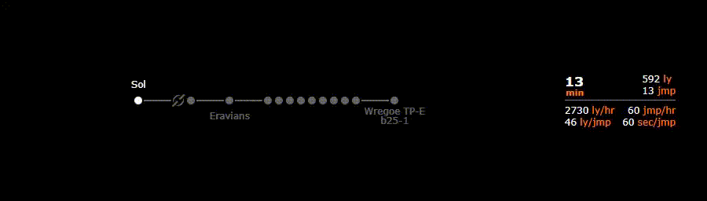
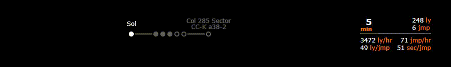
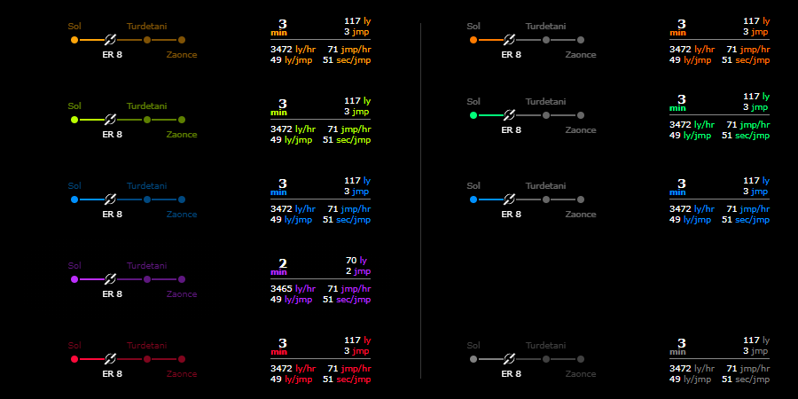
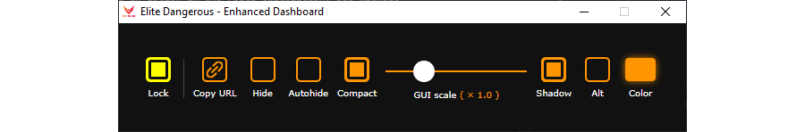
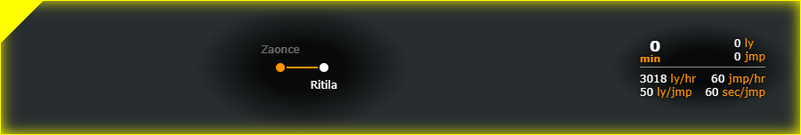
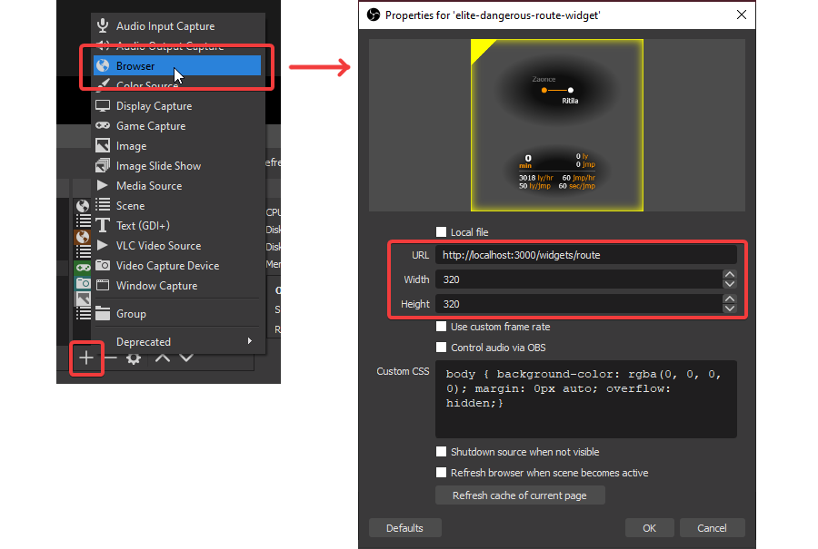
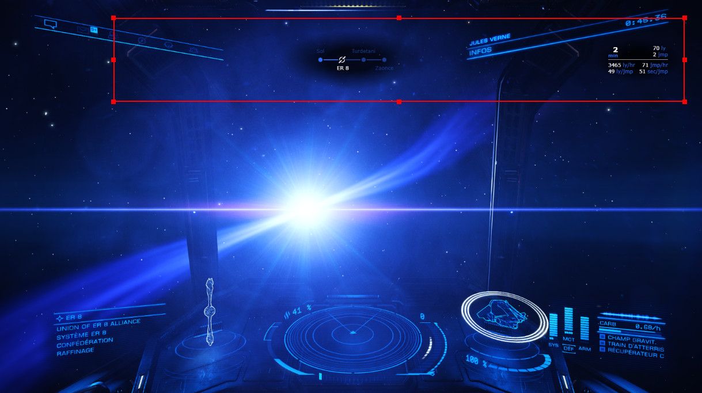
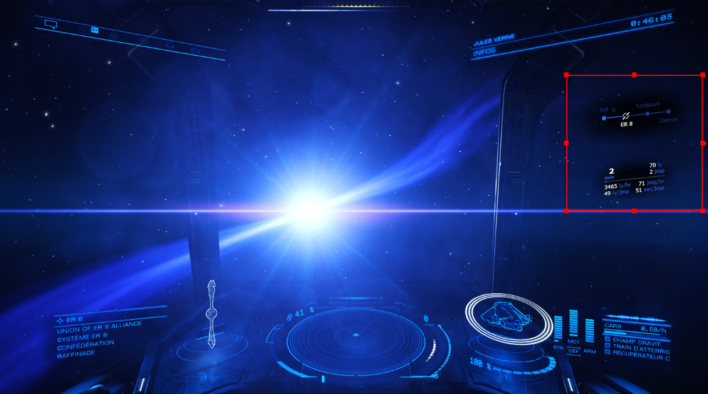

# Elite Dangerous Route Widget (EDRW)
A widget that indicates your position on your current route and some information such as remaining time, distance, and jumps as well as your average speed in light years per hour for example.

This widget is above all designed to be opened as a browser source in streaming software such as OBS. But it can perfectly serve as a companion by being opened in any browser, even on a tablet or mobile.



## Features
- Show your **current position** on the route in **real time**
- Show **name of each system** on the route
- **Compact view** for system with generic name (those that contain numbers)
- Indicate if the primary star of each system is **scoopable or not**, a **neutron** or **white dwarf**
- Displays the **remaining time, distance, and jumps** to the destination
- Displays the **average** over the last 20 jumps (configurable) of the **number of light years per hour**, of **jumps per hour**, of **light years per jump**, and of **seconds per jump**.
- **Transparent background** for integration with OBS or equivalent
- It is possible to activate the **automatic hiding** of the widget when the view in the game is focused on a menu. It will also hide automatically after a certain time (5 min by default, configurable)
- **Customizable theme color**
- Some customization options (shadow, alternative theme, GUI scale, compact view)
- **Synchronization** of the customization options **between all clients** to control the appearance in OBS from another browser.

### Representation of the type of stars
Five types of stars are represented:


### Compact view
Compact view hides systems with a generic name (those with numbers). This is only displayed when it comes to the commander's current position.



### Custom theme color
You can choose any color for the interface theme. There are two variants. One with the whole line of the route is colored (left). The other where only the part already passed is colored (right).



### Vertical layout
It is also possible to have a vertical layout. It suffices for the size of the browser view to be higher than it is wide.


## Download
### From release
You can download the lastest release from [the releases page](https://github.com/Yori-Mirano/elite-dangerous-route-widget/releases).

There is only package for Windows at the moment. For Mac OS and Linux distribs, you can use source from [this repo](https://github.com/Yori-Mirano/elite-dangerous-route-widget) and follow the instructions in the "Download > From source" section of this README.


### From source

#### Prerequisites
Make sure you have installed all of the following prerequisites on your machine:

- [node.js (v14)](https://nodejs.org/dist/latest-v14.x/) - Download & Install Node.js and the npm package manager.

#### Installation 
In a terminal, at the root of the sources folder, type the following command:

```bash
npm install
```

## How to use
### Launch the app
#### From source
Unzip the package where you want, and execute the file `elite-dangerous-route-widget.exe`.

#### From source
In a terminal, at the root of the sources folder, type the following command:

```bash
npm start
```

### How to see the widget in-game
To see the widget in-game, it must be borderless windowed (not the real fullscreen mode).

### Controls
The parameters related to the widget display are directly configurable via the main app window. 

The settings are synchronized between each instance of the widget. You can thus control the appearance of the widget inserted in OBS via the browser of your PC or another device on the same local network.



### Move and resize
To move or resize the widget, you have to unlock it with the yellow **Lock** button on the left.



When unlocked, the widget has a yellow border you can resize with, and a yellow top left corner for moving.

When you're done, you need to lock so you can click through while you play.


### Add to your overlay in OBS (or equivalent)
Click on the **Copy URL** button and paste it in a browser source in OBS (this URL also works in a standard browser on the host and other device via the IP of the host).





For a better integration with the 3D interface of the game, you can for example add the following CSS parameter in the OBS configuration:

```css
transform: skewY(-6deg);
```


### Configuration
A configuration `config.yml` file is automatically generated into `%appdata%/elite-dangerous-route-widget/` when the program is run for the first time. You will have to relaunch it for your changes to take effect (to return to the default configuration, all you have to do is delete the file so that a new one is generated).


## FAQ

### I have an error at launch
Check if the directory path of your E:D logs are correct in the `%appdata%/elite-dangerous-route-widget/config.yml` file, the `eliteLogDir` parameter. The default value is the Windows default directory of an E:D install.

### The route does not always update
This is a known issue. In some cases, the game does not update the file that contains the route. Unfortunately, there is nothing I can do about it.

I have noticed that this happens when you change an option in the route calculation, but without changing the destination. You must then explicitly choose another destination (any one) and then reselect the desired destination again.

