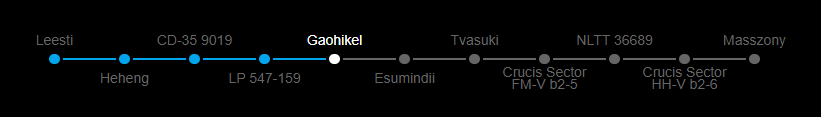

# Elite Dangerous Route Widget (EDRW)
A widget intended to be displayed on a stream via a browser source which shows the position on the current route.




## Features
- Show the current route in real time
- Show your current position on the route
- Show name of each system on the route
- Compact view for system with generic name (those that contain numbers)
- Indicate if the primary star of each system is scoopable or not, a neutron or white dwarf
- Customizable theme color
- Some customization options (shadow, alternative theme, GUI scale, compact view)
- Synchronization of the customization options between all clients to control the appearance in OBS from another browser.
- The options GUI is only displayed when the view is more than 300px height to prevent it from being displayed in OBS.

## Prerequisites
Make sure you have installed all of the following prerequisites on your machine:

- [node.js (v12)](https://nodejs.org/dist/latest-v12.x/) - Download & Install Node.js and the npm package manager.


## Installation 
```bash
npm install
```

Check if the directory path of your E:D logs are correct in the `config.json` file (or `config.sample.json` if the other does not exist), the `eliteLogDir` parameter. The default value is the Windows default directory of an E:D install.


## Usage/Examples
```bash
npm start
```

Open http://localhost:3000 in a browser or as source in OBS or equivalent.
